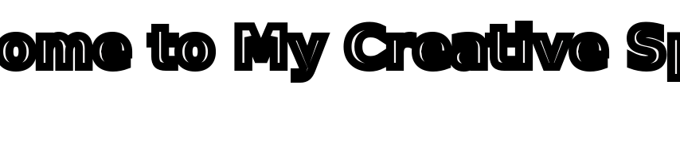

<!--   my-icons -->

    
    
    
    
    

<!--   my-ticker -->

<!-- | 技能(Skill)| Data|
|:----------------:|:------------------:|
|  &nbsp;&nbsp;&nbsp;&nbsp;&nbsp;&nbsp; **编辑器 (Eidtor)** |    &nbsp;&nbsp;&nbsp;&nbsp;&nbsp;|
| **开发工具 (Development Tool)** |   |
| **系统 (System)** |&nbsp;  ||
| **开发板 (Development Board)** |  | -->

<!-- ## 技能树 (Skill Tree)

### 开发工具 (Development Tool)

### 系统 (System)

### 编辑器 (Editor)

### 开发板 (development board)
 -->

## 今年汇总 ✨
 
<!-- -->
